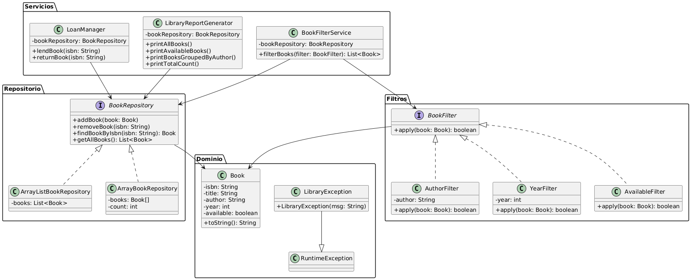

# Sistema de Gestión de Biblioteca

Este proyecto es una aplicación de consola desarrollada en Java que permite gestionar libros en una biblioteca. Aplica principios SOLID, uso de excepciones personalizadas, colecciones, e interfaces.

## Estructura del Proyecto

- `domain/`: entidad principal (`Book`) y excepción personalizada
- `repository/`: interfaz `BookRepository` + implementaciones (`ArrayList`, `Array`)
- `service/`: lógica de negocio (préstamos, reportes, filtrado)
- `filter/`: filtros aplicables según autor, año o disponibilidad
- `Main.java`: interfaz por consola para interactuar con el sistema

## Tecnologías

- Java 8+
- Maven
- IntelliJ IDEA

## Funcionalidades

- Agregar, eliminar, listar libros
- Prestar y devolver libros
- Filtrar por autor, año o disponibilidad
- Generar reportes agrupados

## Principios Aplicados

- SRP, OCP, LSP, ISP, DIP

## 🧩 Diagrama de Clases

El siguiente diagrama muestra la estructura general del sistema, las clases agrupadas por responsabilidades y la aplicación de los principios SOLID:

---

Desarrollado por Kritzan Yeraldin Sullca Espinoza
